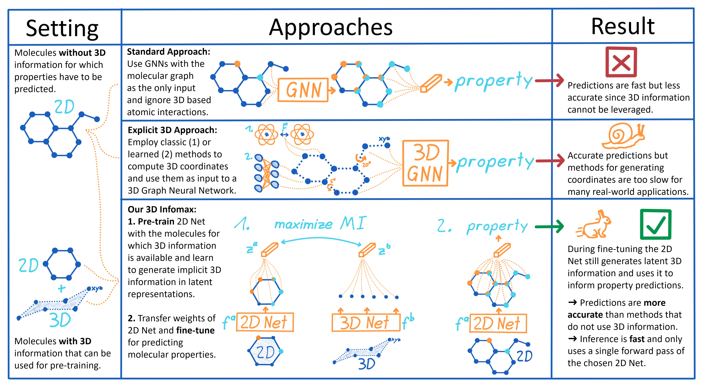

# 3D Infomax improves GNNs for Molecular Property Prediction

### [Video](https://youtu.be/wF4RG171OR0) | [Paper](https://arxiv.org/abs/2110.04126)

We pre-train GNNs to understand the geometry of molecules given only their 2D molecular graph which they can
use for better molecular property predictions. Below is a 3 step guide for how to use the code and how to reproduce
our results and a guide for creating molecular fingerprints. If you have questions, don't hesitate to open an issue or ask me
via [hstark@mit.edu](hstark@mit.edu)
or [social media](https://hannes-stark.com/). I am happy to hear from you!

This repository additionally adapts different self-supervised learning methods to graphs such as "Bootstrap your own
Latent", "Barlow Twins", or "VICReg".



## Generating fingerprints for arbitrary SMILES

To generate fingerprints that carry 3D information, just set up the environment as in step 1 below, 
then place your SMILES into the file `dataset/inference_smiles.txt` and run 

    python inference.py --config=configs_clean/fingerprint_inference.yml

Your fingerprints are saved as pickle file into the `dataset_directory`

## Step 1: Setup Environment

We will set up the environment using [Anaconda](https://docs.anaconda.com/anaconda/install/index.html). Clone the
current repo

    git clone https://github.com/HannesStark/3DInfomax

Create a new environment with all required packages using `environment.yml` (this can take a while). While in the project directory run:

    conda env create

Activate the environment

    conda activate 3DInfomax

## Step 2: 3D Pre-train a model

Let's pre-train a GNN with 50 000 molecules and their structures from the QM9 dataset (you can also skip to Step 3 and
use the pre-trained model weights provided in this repo). For other datasets see the Data section below.

    python train.py --config=configs_clean/pre-train_QM9.yml

This will first create the processed data of `dataset/QM9/qm9.csv` with the 3D information in `qm9_eV.npz`. Then your
model starts pre-training and all the logs are saved in the `runs` folder which will also contain the pre-trained model
as `best_checkpoint.pt` that can later be loaded for fine-tuning.

You can start tensorboard and navigate to `localhost:6006` in your browser to monitor the training process:

    tensorboard --logdir=runs --port=6006

### Explanation:

The config files in `configs_clean` provide additional examples and blueprints to train different models. The files
always contain a `model_type` that should be pre-trained (2D network) and a `model3d_type` (3D network) where you can
specify the parameters of these networks. To find out more about all the other parameters in the config file, have a
look at their description by running `python train.py --help`.

## Step 3: Fine-tune a model

During pre-training a directory is created in the `runs` directory that contains the pre-trained model. We provide an
example of such a directory with already pre-trained
weights `runs/PNA_qmugs_NTXentMultiplePositives_620000_123_25-08_09-19-52` which we can fine-tune for predicting QM9's
homo property as follows.

    python train.py --config=configs_clean/tune_QM9_homo.yml

You can monitor the fine-tuning process on tensorboard as well and in the end the results will be printed to the console
but also saved in the `runs` directory that was created for fine-tuning in the file `evaluation_test.txt`.

The model which we are fine-tuning from is specified in `configs_clean/tune_QM9_homo.yml` via the parameter:

    pretrain_checkpoint: runs/PNA_qmugs_NTXentMultiplePositives_620000_123_25-08_09-19-52/best_checkpoint_35epochs.pt

### Multiple seeds:

This is a second fine-tuning example where we predict non-quantum properties of
the [OGB](https://ogb.stanford.edu/docs/graphprop/) datasets and train multiple seeds (we always use the seeds 1, 2, 3,
4, 5, 6 in our experiments):

    python train.py --config=configs_clean/tune_freesolv.yml

After all runs are done, the averaged results are saved in the `runs` directory of each seed in the
file `multiple_seed_test_statistics.txt`


## Data

You can pre-train or fine-tune on different datasets by specifying the `dataset:` parameter in a .yml file such
as `dataset: drugs` to use GEOM-Drugs.

The QM9 dataset and the [OGB](https://ogb.stanford.edu/docs/graphprop/) datasets are already provided with this
repository. The QMugs and GEOM-Drugs datasets need to be downloaded and placed in the correct location.

GEOM-Drugs: Download
GEOM-Drugs [here](https://dataverse.harvard.edu/dataset.xhtml?persistentId=doi:10.7910/DVN/JNGTDF) (
the `rdkit_folder.tar.gz` file), unzip it, and place it into `dataset/GEOM`.

QMugs: Download QMugs [here](https://libdrive.ethz.ch/index.php/s/X5vOBNSITAG5vzM) (the `structures.tar`
and `summary.csv` files), unzip the `structures.tar`, and place the resulting `structures` folder and the `summary.csv`
file into a new folder `QMugs` that you have to create NEXT TO the repository root. Not in the repository root (sorry
for this).

## Reference 

:page_with_curl: Paper [on arXiv](https://arxiv.org/abs/2110.04126)
```
@article{stark2021_3dinfomax,
  title={3D Infomax improves GNNs for Molecular Property Prediction},
  author={Hannes Stärk and Dominique Beaini and Gabriele Corso and Prudencio Tossou and Christian Dallago and Stephan Günnemann and Pietro Liò},
  journal={arXiv preprint arXiv:2110.04126},
  year={2021}
}
```
